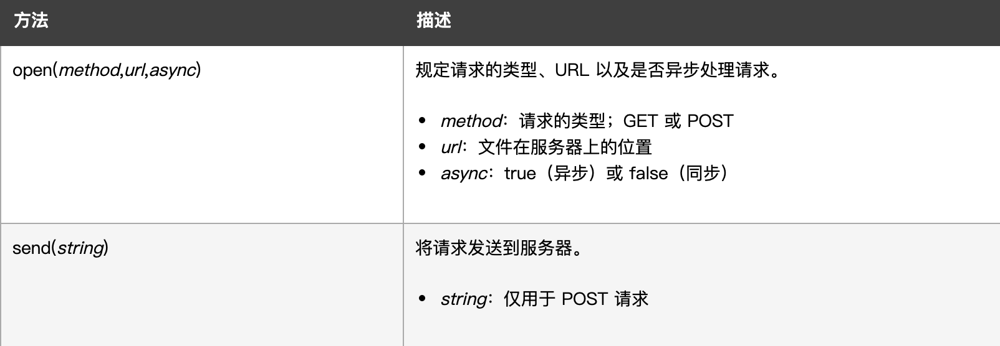
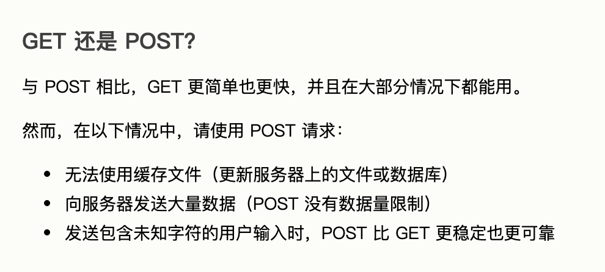
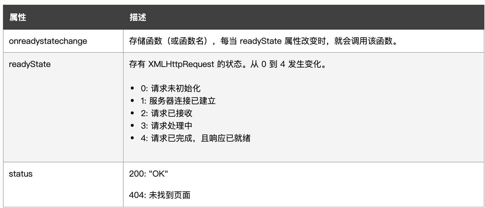

# DOM

## How to divide JS and HTML

### Situation 1

```html
<a href='www.example.com' class = 'popup'></a>
```

```javascript
/*
window.onload： after finishing loading HTML file, instanstly loading this method 
*/
window.onload = prepareLinks;

function prepareLinks() {
    var links = document.getElementsByTagName('a');
    for (var i = 0; i < links.length; i++) {
        if (links[i].getAttribute('class') == 'popup') {
            links[i].onclick = function() {
                popUp(this.getAttribute('href'));
                return false
            }
        }
    }
}

function popUp(url) {
    /*
    open the given url in a new window
    */
    window.open(url,'popUp', "width=500, height=600")
}
```

### Situation 2
```html
<ul id='imagegallery'>
    <li>..<>
    <li>..<>
    <li>..<>
</ul>
```
```javascript

function prepareGallery() {
    var gallery = document.getElementById('imagegallery');
    var links = gallery.getElementsByTagName('a')

    for (var i = 0; i < links.length; i++) {
        links[i].onclick = function() {
            showPic(this)
            return false;
        }
    }
}
```

### Problem

- window.load() could exectue the last method
- How to solve it

First Way
```javascript
// only use this method when few methods are needed to be called
window.onload = function() {
    methodOne();
    methodTwo()
}
```
Second Way
```javascript
function addLoadEvent(func) {
    var oldonload = window.onload;
    if (typeof window.onload != 'function') {
        window.onload = func;
    } else {
        window.onload = function() {
            oldonload();
            func();
        }
    }
}
// call this method everytime when you create a new method
addLoadEvent(func1);
addLoadEvent(func2);
```
___

## AJAX

### XMLHttpRequest

Definition: XMLHttpRequest（XHR）对象用于与服务器交互。通过 XMLHttpRequest 可以在不刷新页面的情况下请求特定 URL，获取数据。这允许网页在不影响用户操作的情况下，更新页面的局部内容。XMLHttpRequest 在 AJAX 编程中被大量使用。

```javascript
// how to create XMLHttpRequest()
var xmlhttp = new XMLHttpRequest();

// how to send request to server
xmlhttp.open('Get','exmaple.txt', true);
xmlhttp.send();

```



Get or Post ?



How to receive information from server ?
```javascript
// responseTesxt => character
document.getElement('myDiv')innerHTML = xmlhttp.responseText;

// responseXML => format of XML
xmlDoc=xmlhttp.responseXML;
txt="";
x=xmlDoc.getElementsByTagName("ARTIST");
for (i=0;i<x.length;i++)
  {
  txt=txt + x[i].childNodes[0].nodeValue + "<br />";
  }
document.getElementById("myDiv").innerHTML=txt;
```

### onreadystatechange

```javascript
/* 
onreadystatechange
 => whenever the state of readystate changes, this function will be called
*/
xmlhttp.onreadystatechange=function()
  {
  if (xmlhttp.readyState==4 && xmlhttp.status==200)
    {
    document.getElementById("myDiv").innerHTML=xmlhttp.responseText;
    }
  }

// if there are multiple of AJAX tasks
// call this function everytime 
// Just like addLoadEvent
function myFunction()
{
loadXMLDoc("ajax_info.txt",function()
  {
  if (xmlhttp.readyState==4 && xmlhttp.status==200)
    {
    document.getElementById("myDiv").innerHTML=xmlhttp.responseText;
    }
  });
}

/*
readyState
0: not initiate
1: start connection
2: receive request
3: handle request
4: finish request
*/

/*
status
200: 'OK'
404: page not found
*/
```